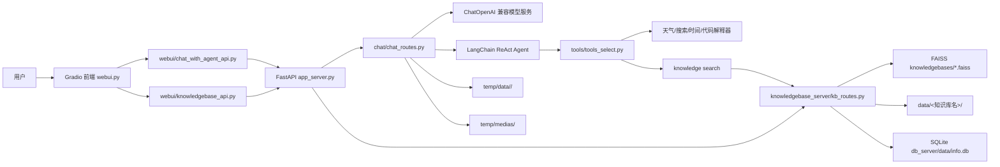
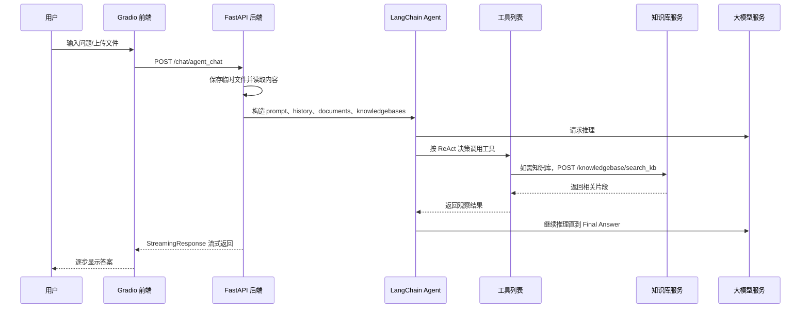

# 基于 Agent 的私人 AI 助理项目文档

## 1. 项目概述

本项目是一个“私人 AI 助理”原型系统，核心能力是通过 Gradio 提供聊天和知识库管理界面，通过 FastAPI 提供后端接口，并使用 LangChain Agent 将大模型、工具调用、本地知识库检索、临时文件阅读和代码解释器串联起来。

项目适合用于学习和演示以下内容：

- 使用 Gradio 构建 AI 对话前端。
- 使用 FastAPI 暴露聊天和知识库管理接口。
- 使用 LangChain ReAct Agent 组织工具调用流程。
- 使用 FAISS 构建本地向量知识库。
- 使用 BM25 + FAISS 做混合检索。
- 使用 SQLite 保存知识库元数据。
- 使用外部大模型、Embedding、天气、搜索等 API 扩展 Agent 能力。
- 支持用户在聊天时临时上传文件，并把文件内容拼接进 Agent 上下文。

从使用者视角看，系统分成两个页面：

- **聊天机器人**：用户输入问题，可上传文件，Agent 根据提示词、历史消息、工具和知识库回答。
- **知识库管理**：创建、删除知识库，上传文档并向量化，供 Agent 后续检索。

从开发者视角看，系统由两个进程组成：

- **后端服务**：`app_server.py`，FastAPI，默认监听 `127.0.0.1:6605`。
- **前端服务**：`webui.py`，Gradio，启动后由 Gradio 输出本地访问地址。

## 2. 项目定位

这个项目不是一个生产级企业系统，而是一个教学和原型性质的 Agent 应用。它把 AI 助理项目中常见的几个模块放在一起：

- LLM 对话。
- ReAct Agent。
- 工具调用。
- RAG 知识库。
- 文件上传和文档解析。
- 代码执行和图片返回。
- 前后端分离式调用。

因此，理解项目时不要只看某一个文件，而要抓住一条主线：

```text
webui.py
  -> webui/chat_with_agent_api.py
  -> app_server.py
  -> chat/chat_routes.py
  -> LangChain Agent
  -> tools/*
  -> knowledgebase_server/kb_routes.py
  -> knowledgebases/*.faiss + db_server/data/info.db
```

## 3. 技术栈

| 类型 | 技术 |
| --- | --- |
| 前端界面 | Gradio |
| 后端接口 | FastAPI |
| 后端服务运行 | Uvicorn |
| Agent 框架 | LangChain ReAct Agent |
| 聊天模型接入 | `langchain_openai.ChatOpenAI`，兼容 OpenAI API 格式 |
| 向量模型接入 | `OpenAIEmbeddings` 兼容接口，另有本地 HuggingFace Embedding 版本 |
| 向量库 | FAISS |
| 关键词检索 | BM25 + jieba 中文分词 |
| 混合检索 | `EnsembleRetriever` |
| 数据库 | SQLite + SQLAlchemy |
| 文件解析 | TextLoader、CSVLoader、PyPDFLoader、UnstructuredMarkdownLoader、PyMuPDF、python-docx |
| HTTP 调用 | requests |
| 代码解释器 | codeboxapi |
| 外部工具 | 天气 API、SerpAPI 搜索 API |

当前源码目录未包含独立的 `requirements.txt`，依赖需要按导入项或课程环境手动安装。此前本机环境中曾使用 Conda 环境 `AI_env` 运行该项目。

## 4. 快速启动

### 4.1 启动前检查

启动前需要确认：

- Python 环境已安装项目依赖。
- 当前工作目录是项目根目录，也就是包含 `app_server.py` 和 `webui.py` 的目录。
- `configs/setting.py` 中的大模型 API 地址、模型名、密钥可用。
- `knowledgebase_server/kb_routes.py` 中的 Embedding API 配置可用。
- `db_server/data/info.db` 存在，或者你已经初始化过数据库表。
- 如果使用本地 Embedding 版本，需要确认 `embedding_model_path` 指向的模型目录存在。
- 如果启用代码解释器，需要确认 CodeBox 相关依赖和运行环境可用。

### 4.2 启动后端

在项目根目录运行：

```powershell
python app_server.py
```

正常情况下，后端会监听：

```text
http://127.0.0.1:6605
```

后端提供：

- `/chat/agent_chat`
- `/knowledgebase/create_kb`
- `/knowledgebase/delete_kb`
- `/knowledgebase/list_kbs`
- `/knowledgebase/upload_docs`
- `/knowledgebase/delete_docs`
- `/knowledgebase/search_kb`
- `/media/*`

### 4.3 启动前端

另开一个终端，在同一个项目根目录运行：

```powershell
python webui.py
```

Gradio 会输出一个本地访问地址。打开这个地址即可进入前端页面。

### 4.4 启动顺序

推荐顺序是：

1. 启动 `app_server.py`。
2. 确认后端 `127.0.0.1:6605` 正常运行。
3. 启动 `webui.py`。
4. 在 Gradio 页面中聊天或管理知识库。

必须先启动后端，因为 `webui/chat_with_agent_api.py` 和 `webui/knowledgebase_api.py` 都硬编码调用 `http://127.0.0.1:6605`。

## 5. PyCharm 运行方式

如果使用 PyCharm，建议建立两个运行配置。

### 5.1 后端运行配置

| 配置项 | 值 |
| --- | --- |
| Script path | `app_server.py` |
| Working directory | 项目根目录 |
| Python interpreter | 已安装依赖的 Python/Conda 环境 |

启动后端后，控制台应看到 Uvicorn 服务监听 `127.0.0.1:6605`。

### 5.2 前端运行配置

| 配置项 | 值 |
| --- | --- |
| Script path | `webui.py` |
| Working directory | 项目根目录 |
| Python interpreter | 与后端相同或兼容的 Python 环境 |

启动前端后，控制台会打印 Gradio 的本地访问地址。

### 5.3 常见 PyCharm 问题

| 现象 | 可能原因 | 处理方式 |
| --- | --- | --- |
| `ModuleNotFoundError` | 解释器不是项目依赖所在环境 | 切换到正确 Conda/venv 解释器 |
| 前端提示请求失败 | 后端未启动或端口不是 `6605` | 先运行 `app_server.py` |
| PDF 解析报错 | 装错了 `fitz` 包或缺少 PyMuPDF | 使用 `PyMuPDF`，不要用错误的 `fitz` 包替代 |
| 知识库创建失败 | Embedding API 不可用或密钥无效 | 检查 `kb_routes.py` 中的 Embedding 配置 |
| 代码解释器启动失败 | CodeBox 或其依赖不可用 | 先单独确认 codeboxapi 环境 |

## 6. 目录结构说明

```text
.
├── app_server.py
├── webui.py
├── generate.py
├── configs/
├── chat/
├── webui/
├── knowledgebase_server/
├── db_server/
├── tools/
├── utils/
├── data/
├── knowledgebases/
├── temp/
├── logs/
├── static/
├── .codebox/
├── test.csv
└── 黑神话悟空.txt
```

### 6.1 根目录文件

| 文件 | 作用 |
| --- | --- |
| `app_server.py` | FastAPI 后端入口。创建应用、开启跨域、挂载聊天和知识库路由、挂载媒体静态目录，直接运行时监听 `127.0.0.1:6605`。 |
| `webui.py` | Gradio 前端入口。提供“聊天机器人”和“知识库管理”两个 Tab。 |
| `generate.py` | 示例数据生成脚本。生成正态分布随机数并写入 `test.csv`。 |
| `test.csv` | 示例 CSV 文件，可用于测试文件上传、解析或代码解释器。 |
| `黑神话悟空.txt` | 示例文本文件，可用于知识库上传或聊天时文件上传。 |
| `__init__.py` | 包标识文件，当前为空。 |

### 6.2 `configs/`

| 文件 | 作用 |
| --- | --- |
| `configs/setting.py` | 项目核心配置。包含聊天模型名、API 地址、API 密钥、Embedding 模型路径、知识库目录、临时目录、数据库路径、超时时间、媒体目录等。 |
| `configs/prompt.py` | Agent ReAct 提示词模板。定义工具列表、知识库列表、文档内容、历史记录、问题和 scratchpad 的拼接格式。 |
| `configs/__init__.py` | 包标识文件。 |

注意：当前配置文件里存在明文 API Key。项目文档不展开这些密钥，实际维护时建议改为环境变量读取。

### 6.3 `chat/`

| 文件 | 作用 |
| --- | --- |
| `chat/chat_routes.py` | 聊天后端路由。提供 `/chat/agent_chat`，接收用户问题、历史消息、上传文件、模型参数和会话 ID，创建 LangChain Agent 并流式返回最终答案。 |
| `chat/__init__.py` | 包标识文件。 |

`chat_routes.py` 是对话链路的核心文件。它负责：

- 保存聊天时上传的临时文件。
- 解析文件内容并拼入 Agent 上下文。
- 处理历史消息长度。
- 初始化 `ChatOpenAI`。
- 使用 `PROMPT_TEMPLATES["agent"]` 构造提示词。
- 使用 `tools/tools_select.py` 中的工具列表创建 ReAct Agent。
- 从数据库读取所有知识库名称和描述，帮助 Agent 判断是否调用知识库工具。
- 使用自定义 callback 只流式输出 `Final Answer:` 之后的内容。
- 如果代码解释器生成图片，通过 `/media` 地址返回 Markdown 图片链接。

### 6.4 `webui/`

| 文件 | 作用 |
| --- | --- |
| `webui/chat_with_agent_api.py` | Gradio 聊天页调用后端聊天接口的适配层。负责解析 Gradio 的多模态输入、打开上传文件、组织 form data、接收流式响应并逐步 yield 给聊天窗口。 |
| `webui/knowledgebase_api.py` | Gradio 知识库管理页调用后端知识库接口的适配层。封装创建、删除、上传、刷新知识库列表等操作。 |
| `webui/__init__.py` | 包标识文件。 |

前端并不直接操作 FAISS 或数据库，而是通过 HTTP 请求调用 FastAPI 后端。

### 6.5 `knowledgebase_server/`

| 文件/目录 | 作用 |
| --- | --- |
| `knowledgebase_server/kb_routes.py` | 当前后端实际挂载的知识库路由，使用兼容 OpenAI Embedding API 的远程 Embedding 服务。 |
| `knowledgebase_server/kb_routes_local.py` | 本地 Embedding 版本的知识库路由，使用 `HuggingFaceEmbeddings(model_name=embedding_model_path)`。当前未被 `app_server.py` 挂载。 |
| `knowledgebase_server/loader/loader.py` | 根据文件后缀选择 LangChain 文档 Loader。支持 `.txt`、`.pdf`、`.md`、`.csv`。 |
| `knowledgebase_server/splitter/splitter.py` | 当前为空，像是预留的文本切分扩展位置。 |
| `knowledgebase_server/__init__.py` | 包标识文件。 |

知识库主流程：

1. 创建知识库时，先创建一个临时 `init` 文档。
2. 用这个文档初始化 FAISS。
3. 删除临时文档，保存一个空 FAISS 知识库目录。
4. 将知识库名称和描述写入 SQLite。
5. 上传文档时，将原文件保存到 `data/<知识库名>/`。
6. 使用 Loader 加载文档。
7. 使用 `RecursiveCharacterTextSplitter` 切块。
8. 加载对应 FAISS 索引。
9. 将 chunks 向量化并加入 FAISS。
10. 保存更新后的 FAISS 索引。

检索流程：

1. 根据知识库名找到 `knowledgebases/<知识库名>.faiss`。
2. 加载 FAISS 向量库。
3. 从 FAISS docstore 中取出所有文档。
4. 基于文档构建 BM25Retriever，并使用 jieba 中文分词。
5. 创建 FAISS retriever，默认返回 `k=2`。
6. 使用 `EnsembleRetriever` 将 BM25 和 FAISS 以 `0.5/0.5` 权重组合。
7. 返回来源路径和文本片段。

### 6.6 `db_server/`

| 文件/目录 | 作用 |
| --- | --- |
| `db_server/base.py` | SQLAlchemy 数据库连接、模型定义和全局 session。定义 `KnowledgeBase` 表结构。 |
| `db_server/knowledge_base_repository.py` | 知识库元数据的增删查操作。 |
| `db_server/data/info.db` | SQLite 数据库文件，保存知识库名称和描述。 |
| `db_server/__init__.py` | 包标识文件。 |

`KnowledgeBase` 表字段：

| 字段 | 类型 | 作用 |
| --- | --- | --- |
| `id` | Integer | 自增主键 |
| `kb_name` | String(50) | 知识库名称 |
| `kb_info` | String(200) | 知识库简介，供 Agent 判断是否调用该知识库 |

注意：`Base.metadata.create_all(engine)` 在当前代码中被注释。如果在全新环境中没有 `info.db` 或表不存在，需要手动初始化表。

### 6.7 `tools/`

| 文件 | 作用 |
| --- | --- |
| `tools/tools_select.py` | 将各工具封装成 LangChain `Tool` 列表，供 Agent 使用。 |
| `tools/weather_check.py` | 天气查询工具，调用心知天气 API。 |
| `tools/web_search.py` | 网络搜索工具，调用 SerpAPI 的 Baidu 搜索接口。 |
| `tools/knowledge_search.py` | 知识库检索工具，调用后端 `/knowledgebase/search_kb` 接口。 |
| `tools/get_time.py` | 当前时间工具。 |
| `tools/code_interpreter.py` | Python 代码解释器工具，调用 CodeBox 执行代码，支持保存 PNG 图片到媒体目录。 |
| `tools/__init__.py` | 包标识文件。 |

Agent 可用工具列表：

| 工具名 | 来源 | 输入 | 输出 |
| --- | --- | --- | --- |
| `weather check` | `weather_check.py` | 城市名 | 天气和温度 |
| `web search` | `web_search.py` | 搜索关键词 | 标题、链接、摘要 |
| `knowledge search` | `knowledge_search.py` | `知识库名,问题` | 相关来源和内容片段 |
| `get time` | `get_time.py` | 空字符串 | 当前时间 |
| `code interpreter` | `code_interpreter.py` | Python 代码字符串 | 执行结果或图片链接 |

### 6.8 `utils/`

| 文件 | 作用 |
| --- | --- |
| `utils/callback.py` | 自定义 LangChain 异步 callback。它监听模型输出，只在检测到 `Final Answer:` 后把 token 放入队列，供 FastAPI 流式返回。 |
| `utils/load_docs.py` | 聊天临时文件读取工具。支持 `.txt`、`.csv`、`.json`、`.pdf`、`.docx`、`.md`、`.py`。 |
| `utils/downloader.py` | ModelScope 模型下载脚本，用于下载本地 Embedding 模型。 |
| `utils/__init__.py` | 包标识文件。 |

### 6.9 数据和运行时目录

| 目录 | 作用 |
| --- | --- |
| `data/` | 知识库上传原始文件的持久化目录，通常结构是 `data/<知识库名>/<文件名>`。 |
| `knowledgebases/` | FAISS 索引持久化目录，通常结构是 `knowledgebases/<知识库名>.faiss/index.faiss` 和 `index.pkl`。 |
| `temp/data/` | 聊天时临时上传文件的保存目录，通常按 `session_id` 分目录。 |
| `temp/medias/` | 代码解释器生成图片后的保存目录，由 FastAPI 通过 `/media` 暴露。 |
| `temp/knowledgebases/` | 配置中预留的临时知识库目录，当前主流程使用较少。 |
| `logs/` | 本地运行日志。 |
| `.codebox/` | CodeBox 运行相关目录。 |
| `static/` | 静态资源目录，当前主入口未直接挂载该目录。 |

## 7. 系统架构

### 7.1 整体架构图



### 7.2 前后端调用关系



## 8. 核心业务流程

### 8.1 聊天流程

入口：

```text
webui.py -> gr.ChatInterface(fn=chat_with_agent)
```

前端适配：

```text
webui/chat_with_agent_api.py -> chat_with_agent()
```

后端接口：

```text
POST /chat/agent_chat
```

主要步骤：

1. Gradio 收到用户输入。
2. `parse_prompt()` 兼容普通文本输入和多模态输入。
3. 如果用户上传文件，前端打开本地临时文件并通过 multipart/form-data 转发给后端。
4. 后端 `files_rag()` 把上传文件保存到 `temp/data/<session_id>/`。
5. 后端用 `utils/load_docs.py` 读取文件内容，并拼接成 `documents` 字符串。
6. 后端根据 `history_len` 截断历史消息。
7. 后端初始化 `ChatOpenAI`。
8. 后端从数据库读取知识库列表和描述。
9. 后端创建 ReAct Agent。
10. Agent 根据 prompt 自行决定是否调用工具。
11. callback 监听模型输出，只把 `Final Answer:` 之后的内容返回给前端。
12. 如果代码解释器生成了图片，后端追加 Markdown 图片链接。

### 8.2 知识库创建流程

入口：

```text
Gradio 知识库管理页 -> create_kb()
```

后端接口：

```text
POST /knowledgebase/create_kb
```

请求体示例：

```json
{
  "kb_name": "test",
  "kb_info": "用于测试的知识库"
}
```

主要步骤：

1. 检查 `knowledgebases/test.faiss` 是否已存在。
2. 用临时文档初始化 FAISS。
3. 删除临时文档，使其成为空知识库。
4. 保存 FAISS 索引目录。
5. 写入 SQLite 元数据。

### 8.3 文档上传和向量化流程

入口：

```text
Gradio 知识库管理页 -> upload_docs()
```

后端接口：

```text
POST /knowledgebase/upload_docs
```

表单字段：

| 字段 | 类型 | 说明 |
| --- | --- | --- |
| `files` | file[] | 上传的文档 |
| `kb_name` | string | 知识库名称 |
| `chunk_size` | int | 单段文本最大长度，默认 128 |
| `chunk_overlap` | int | 相邻文本重叠长度，默认 20 |

支持的知识库上传格式：

- `.txt`
- `.pdf`
- `.md`
- `.csv`

主要步骤：

1. 保存原始文件到 `data/<知识库名>/`。
2. 根据文件后缀选择 Loader。
3. 加载文档为 LangChain Document。
4. 使用 `RecursiveCharacterTextSplitter` 切块。
5. 加载现有 FAISS 索引。
6. 将切块文本向量化。
7. 写回 FAISS 索引。

### 8.4 知识库检索流程

后端接口：

```text
POST /knowledgebase/search_kb
```

请求体示例：

```json
{
  "kb_name": "test",
  "query": "黑神话悟空的主要内容是什么"
}
```

主要步骤：

1. 加载指定知识库的 FAISS 索引。
2. 用 FAISS 做向量检索。
3. 用 BM25 做关键词检索。
4. 使用 jieba 做中文分词。
5. 使用 `EnsembleRetriever` 合并两类结果。
6. 返回文档来源和文本内容。

返回结构示例：

```json
{
  "results": [
    {
      "sources": "data/test/黑神话悟空.txt",
      "page_contents": "相关文本片段"
    }
  ]
}
```

### 8.5 代码解释器流程

工具入口：

```text
tools/code_interpreter.py -> code_interpreter.run(code)
```

主要步骤：

1. 初始化 `CodeBox(api_key="local")`。
2. 在模块导入时启动 CodeBox。
3. Agent 调用工具时传入 Python 代码字符串。
4. 工具清理 Markdown 代码块标记。
5. 交给 CodeBox 执行。
6. 如果输出是 `image/png`，将图片保存到 `temp/medias/`。
7. 通过 `/media/<filename>` 返回给前端。

注意：这个工具具备执行任意 Python 代码的能力，只适合可信环境和教学演示，不应直接暴露给不可信用户。

## 9. API 文档

### 9.1 `POST /chat/agent_chat`

用于 Agent 聊天。

请求类型：

```text
multipart/form-data
```

字段：

| 字段 | 类型 | 必填 | 默认值 | 说明 |
| --- | --- | --- | --- | --- |
| `files` | file[] | 否 | `None` | 用户上传的临时文件 |
| `query` | string | 是 | 无 | 用户问题 |
| `sys_prompt` | string | 否 | `You are a helpful assistant.` | 系统提示词 |
| `history_len` | int | 否 | `-1` | 保留多少轮历史，`-1` 表示不截断 |
| `history` | string[] | 否 | `[]` | Gradio 历史消息字符串 |
| `temperature` | float | 否 | `0.5` | 模型采样温度 |
| `max_tokens` | int | 否 | `1024` | 最大输出 token |
| `session_id` | string | 否 | `None` | 会话 ID，用于临时文件目录 |

响应：

```text
StreamingResponse
media_type = application/json
```

每个 chunk 结构类似：

```json
{
  "answer": "部分回答内容"
}
```

### 9.2 `POST /knowledgebase/create_kb`

创建知识库。

请求类型：

```text
application/json
```

请求体：

| 字段 | 类型 | 必填 | 说明 |
| --- | --- | --- | --- |
| `kb_name` | string | 是 | 知识库名称 |
| `kb_info` | string | 否 | 知识库描述，供 Agent 选择知识库 |

成功响应：

```json
{
  "message": "知识库 'xxx' 创建成功！"
}
```

### 9.3 `DELETE /knowledgebase/delete_kb`

删除知识库。

参数：

| 字段 | 位置 | 类型 | 必填 | 说明 |
| --- | --- | --- | --- | --- |
| `kb_name` | query | string | 是 | 知识库名称 |

效果：

- 删除 `knowledgebases/<kb_name>.faiss`。
- 删除 `data/<kb_name>`。
- 删除 SQLite 中对应元数据。

### 9.4 `GET /knowledgebase/list_kbs`

列出当前知识库。

响应示例：

```json
{
  "knowledgebases": [
    "test.faiss",
    "zaofenxiang.faiss"
  ]
}
```

注意：这个接口从 `knowledgebases/` 文件夹扫描 `.faiss` 目录，不是直接读取 SQLite。

### 9.5 `POST /knowledgebase/upload_docs`

上传文档到指定知识库并向量化。

请求类型：

```text
multipart/form-data
```

字段：

| 字段 | 类型 | 必填 | 说明 |
| --- | --- | --- | --- |
| `files` | file[] | 是 | 上传文档 |
| `kb_name` | string | 是 | 知识库名称 |
| `chunk_size` | int | 否 | 文本切块长度 |
| `chunk_overlap` | int | 否 | 文本切块重叠长度 |

成功响应：

```json
{
  "message": "File '['example.txt']' added to database 'test' successfully"
}
```

### 9.6 `POST /knowledgebase/delete_docs`

从知识库中删除指定文档。

请求类型：

```text
application/json
```

请求体：

```json
{
  "file_names": ["example.txt"],
  "kb_name": "test"
}
```

响应：

```json
{
  "success": ["example.txt"],
  "failed": {}
}
```

### 9.7 `POST /knowledgebase/search_kb`

检索指定知识库。

请求类型：

```text
application/json
```

请求体：

```json
{
  "kb_name": "test",
  "query": "要查询的问题"
}
```

响应：

```json
{
  "results": [
    {
      "sources": "来源文件路径",
      "page_contents": "命中的文本片段"
    }
  ]
}
```

## 10. 配置说明

配置集中在 `configs/setting.py`。

| 配置项 | 当前含义 |
| --- | --- |
| `chat_model_name` | 聊天模型名称。 |
| `api_key` | 聊天模型 API Key。当前为明文配置，建议改环境变量。 |
| `base_url` | 聊天模型 API Base URL。 |
| `embedding_model_path` | 本地 Embedding 模型路径，供本地知识库路由使用。 |
| `KB_DIR` | FAISS 知识库存储目录。 |
| `TEMP_KB_DIR` | 临时知识库目录。 |
| `FILE_STORAGE_DIR` | 知识库原始文件存储目录。 |
| `TEMP_FILE_STORAGE_DIR` | 聊天临时文件存储目录。 |
| `SQLALCHEMY_DATABASE` | SQLite 数据库目录。 |
| `SQLALCHEMY_DATABASE_URI` | SQLite 连接 URI。 |
| `TIME_OUT` | 外部请求和 Agent 等待超时时间。 |
| `MEDIA_DIR` | 代码解释器图片输出目录。 |

其他明文密钥还分散在：

- `knowledgebase_server/kb_routes.py`
- `tools/web_search.py`
- `tools/weather_check.py`

生产或长期维护时，应统一改为：

```powershell
$env:CHAT_API_KEY="..."
$env:EMBEDDING_API_KEY="..."
$env:SERPAPI_API_KEY="..."
$env:WEATHER_API_KEY="..."
```

然后在 Python 中用 `os.getenv()` 读取。

## 11. Prompt 和 Agent 机制

Agent 提示词定义在 `configs/prompt.py`。

模板包含以下变量：

| 变量 | 来源 | 作用 |
| --- | --- | --- |
| `{tools}` | LangChain 工具列表 | 告诉模型有哪些工具可用 |
| `{tool_names}` | 工具名称列表 | 限定 `Action` 可选项 |
| `{knowledgebases}` | SQLite 知识库元数据 | 告诉模型有哪些知识库 |
| `{documents}` | 聊天临时上传文件内容 | 把用户上传文件直接作为上下文 |
| `{history}` | 历史消息 | 给模型提供上下文 |
| `{input}` | 用户当前问题 | 当前要回答的问题 |
| `{agent_scratchpad}` | Agent 中间推理记录 | ReAct 调用工具所需 |

ReAct 格式要求模型按以下结构工作：

```text
Question
Thought
Action
Action Input
Observation
...
Final Answer
```

`utils/callback.py` 的设计依赖 `Final Answer:` 这个输出前缀。只有模型输出到最终答案阶段，内容才会被放入队列并返回给前端。

## 12. 文件解析能力

项目里有两套文件解析逻辑。

### 12.1 知识库上传解析

位置：

```text
knowledgebase_server/loader/loader.py
```

支持：

| 后缀 | Loader |
| --- | --- |
| `.txt` | `TextLoader` |
| `.pdf` | `PyPDFLoader` |
| `.md` | `UnstructuredMarkdownLoader` |
| `.csv` | `CSVLoader` |

不支持的格式会抛出 `HTTPException(400, "Unsupported file format")`。

### 12.2 聊天临时文件解析

位置：

```text
utils/load_docs.py
```

支持：

| 后缀 | 解析方式 |
| --- | --- |
| `.txt` | UTF-8 文本读取 |
| `.csv` | UTF-8 文本读取 |
| `.json` | `json.load` 后格式化 |
| `.pdf` | PyMuPDF `fitz.open` |
| `.docx` | python-docx |
| `.md` | UTF-8 文本读取 |
| `.py` | UTF-8 文本读取 |

聊天临时文件解析比知识库上传解析支持更多格式。

## 13. 数据存储设计

### 13.1 知识库索引

路径：

```text
knowledgebases/<知识库名>.faiss/
├── index.faiss
└── index.pkl
```

说明：

- `index.faiss` 保存向量索引。
- `index.pkl` 保存 docstore 等 Python 对象。
- 当前代码加载 FAISS 时启用了 `allow_dangerous_deserialization=True`。

### 13.2 知识库原始文件

路径：

```text
data/<知识库名>/<文件名>
```

说明：

- 上传到知识库的原始文件会保存在这里。
- 删除知识库时会删除对应目录。
- 删除单个文档时会删除对应文件，并尝试从 FAISS docstore 中移除相关 chunk。

### 13.3 SQLite 元数据

路径：

```text
db_server/data/info.db
```

表：

```text
knowledge_bases
```

用途：

- 保存知识库名称。
- 保存知识库描述。
- Agent 聊天前读取这些描述，用于判断是否调用某个知识库。

### 13.4 聊天临时文件

路径：

```text
temp/data/<session_id>/<文件名>
```

用途：

- 保存用户在聊天窗口临时上传的文件。
- 文件内容会在当前问题中被拼入 `documents`。

### 13.5 代码解释器媒体文件

路径：

```text
temp/medias/image-<uuid>.png
```

访问 URL：

```text
http://localhost:6605/media/image-<uuid>.png
```

## 14. 日志和临时文件

| 路径 | 说明 |
| --- | --- |
| `logs/` | 本地运行时保存的 stdout/stderr 日志。 |
| `temp/app_server.out.log` | 后端历史输出日志之一。 |
| `temp/app_server.err.log` | 后端历史错误日志之一。 |
| `temp/data/` | 聊天上传的临时文件。 |
| `temp/medias/` | 代码解释器生成的图片。 |

这些文件多数属于运行时产物，文档和代码维护时要避免把临时数据误认为核心源码。

## 15. 安全和稳定性注意事项

当前项目适合本地教学演示，但如果要对外开放或长期使用，需要重点处理以下问题。

### 15.1 明文 API Key

多个文件中存在明文 API Key。风险包括：

- 代码泄露导致密钥泄露。
- 难以区分开发、测试、生产环境。
- 密钥轮换困难。

建议：

- 改为环境变量。
- 提供 `.env.example`，不要提交真实 `.env`。
- 对历史提交或共享压缩包做密钥清理。

### 15.2 CORS 全开放

`app_server.py` 当前配置：

```python
allow_origins=["*"]
```

本地开发方便，但生产环境应限制为可信前端域名。

### 15.3 FAISS 反序列化风险

知识库加载使用：

```python
allow_dangerous_deserialization=True
```

这意味着如果攻击者能篡改 `index.pkl`，可能带来反序列化风险。

建议：

- 不加载不可信来源的 FAISS 索引。
- 限制知识库目录写入权限。
- 对知识库来源做签名或校验。
- 如果框架支持更安全的保存格式，优先迁移。

### 15.4 文件路径风险

上传文件使用 `file.filename` 拼接到本地路径：

```python
os.path.join(kb_file_storage_path, file.filename)
```

如果文件名未清洗，理论上有路径穿越风险。

建议：

- 使用 `os.path.basename()` 清理文件名。
- 拒绝包含 `..`、路径分隔符或控制字符的文件名。
- 限制允许上传的文件类型和大小。

### 15.5 代码解释器风险

`code_interpreter` 可以执行 Python 代码，并且在模块导入时启动 CodeBox。

风险：

- 任意代码执行。
- 资源消耗不可控。
- 启动失败会影响整个聊天路由导入。

建议：

- 只在可信本地环境启用。
- 增加开关配置。
- 延迟初始化 CodeBox。
- 限制执行时间、文件系统权限、网络权限和资源使用。

### 15.6 缺少认证和权限控制

当前接口没有登录、鉴权或权限隔离。任何能访问后端的人都可以：

- 聊天。
- 上传文件。
- 创建知识库。
- 删除知识库。
- 触发工具调用。
- 触发代码执行。

如果要部署到局域网或公网，必须增加认证和权限控制。

## 16. 当前实现限制

| 限制 | 说明 |
| --- | --- |
| 依赖未集中声明 | 当前源码目录没有 `requirements.txt` 或 `pyproject.toml`。 |
| 前后端地址硬编码 | 前端固定访问 `http://127.0.0.1:6605`。 |
| 数据库初始化不完整 | `Base.metadata.create_all(engine)` 被注释，新环境可能没有表。 |
| 全局数据库 session | `db_server/base.py` 使用全局 session，并发场景不够稳妥。 |
| 知识库列表来源不一致 | 前端 list 接口扫描文件夹，Agent 知识库描述从 SQLite 读取，两者可能不一致。 |
| 工具输入解析较脆弱 | `knowledge search` 依赖英文逗号切分 `知识库名,问题`。 |
| 错误处理偏简单 | 多数外部 API 失败只返回简单字符串。 |
| 流式 JSON 边界依赖 requests chunk | 前端直接对每个 chunk 做 `json.loads`，如果多个 JSON 粘连可能出错。 |
| 临时文件清理缺失 | `temp/data/`、`temp/medias/` 没有自动清理策略。 |
| 不适合多用户隔离 | 会话、知识库、工具执行没有严格用户隔离。 |

## 17. 常见问题排查

### 17.1 前端启动后聊天失败

检查：

- `app_server.py` 是否已经启动。
- 后端端口是否是 `6605`。
- 控制台是否有 `ModuleNotFoundError`。
- `configs/setting.py` 中模型 API 是否可用。
- 网络是否能访问对应模型服务。

### 17.2 创建知识库失败

检查：

- `knowledgebases/` 目录是否可写。
- Embedding API Key 是否可用。
- `knowledgebase_server/kb_routes.py` 是否能成功初始化 Embedding。
- 知识库名称是否已经存在。
- SQLite 表是否存在。

### 17.3 上传 PDF 失败

检查：

- 是否安装了 PDF 解析依赖。
- 如果是聊天临时文件解析，确认 `PyMuPDF` 可用。
- 如果是知识库上传，确认 `PyPDFLoader` 相关依赖可用。
- 文件是否损坏或加密。

### 17.4 知识库搜索没有结果

检查：

- 是否真的上传并向量化过文档。
- `knowledgebases/<知识库名>.faiss` 是否存在。
- `data/<知识库名>/` 中是否有原始文件。
- 查询时知识库名是否和目录名一致。
- Embedding 模型是否和建库时一致。

### 17.5 Agent 不调用知识库

可能原因：

- SQLite 中没有对应知识库描述。
- `kb_info` 太模糊，模型不知道应该使用该知识库。
- prompt 中没有足够明确地要求优先使用知识库。
- Agent 选择了其他工具。

处理方式：

- 创建知识库时写清楚 `kb_info`。
- 在用户问题中明确说“请查询 xxx 知识库”。
- 调整 `configs/prompt.py` 中的 Agent 规则。

### 17.6 代码解释器导致后端启动慢或失败

原因：

- `tools/code_interpreter.py` 在导入时就会执行 `self.codebox.start()`。
- `chat/chat_routes.py` 导入了 `code_interpreter`。
- 因此后端启动或导入聊天路由时就可能触发 CodeBox 初始化。

处理方式：

- 先确认 CodeBox 单独可启动。
- 暂时从 `tools/tools_select.py` 中移除 code interpreter 工具。
- 或把 CodeBox 改为第一次调用时再初始化。

## 18. 面试或答辩讲解思路

可以按下面顺序介绍项目：

1. 这是一个基于 Agent 的私人 AI 助理项目，目标是把大模型对话、工具调用和本地知识库问答整合到一个可交互系统里。
2. 前端使用 Gradio，提供聊天页和知识库管理页。
3. 后端使用 FastAPI，拆成聊天路由和知识库路由。
4. 聊天链路中，后端用 LangChain ReAct Agent 接入 LLM，并暴露天气、搜索、时间、代码解释器、本地知识库检索等工具。
5. 知识库部分使用 FAISS 保存向量索引，SQLite 保存知识库元数据，上传文档后用 Loader 解析、TextSplitter 切块、Embedding 向量化。
6. 检索时不只用向量相似度，还组合了 BM25 关键词检索，对中文文本使用 jieba 分词。
7. 聊天时还支持临时上传文件，系统会读取文件内容并放入 Agent 上下文。
8. 代码解释器可以执行 Python，并把生成的图片保存为媒体文件返回前端。
9. 这个项目的亮点是功能完整、链路清晰、覆盖了 Agent 应用常见模块。
10. 当前不足是密钥明文、权限控制缺失、FAISS 反序列化风险、代码解释器风险和工程化配置不够完善。

## 19. 后续改进建议

如果要把项目从教学原型推进到更稳定的本地工具，建议按优先级处理：

1. 把所有 API Key 改成环境变量。
2. 增加 `requirements.txt` 或 `pyproject.toml`。
3. 增加 `.env.example` 和配置读取模块。
4. 恢复或补充数据库初始化脚本。
5. 清理上传文件名，增加文件类型和大小限制。
6. 给知识库名称增加白名单或安全校验。
7. 限制 CORS 来源。
8. 将 CodeBox 改为按需初始化，并增加开关。
9. 为知识库接口增加最小测试。
10. 为前端 API 适配层增加异常处理和资源关闭。
11. 增加临时文件清理机制。
12. 增加日志格式和错误追踪。
13. 将前后端后端地址改成配置项。
14. 统一知识库列表的数据来源，避免文件系统和 SQLite 不一致。
15. 根据用户或项目维度做知识库隔离。

## 20. 最小验证清单

每次修改后，可以按这个顺序验证：

1. 运行 `python app_server.py`，确认后端能启动。
2. 运行 `python webui.py`，确认前端能启动。
3. 打开 Gradio 页面，发送普通文本问题。
4. 上传 `.txt` 文件进行聊天，确认文件内容被读取。
5. 创建一个测试知识库。
6. 上传 `.txt` 或 `.csv` 到知识库。
7. 调用知识库问题，确认 Agent 能检索。
8. 测试天气、时间等简单工具。
9. 如果启用代码解释器，测试一段简单 Python 代码。
10. 查看 `logs/` 和终端输出，确认没有明显异常。

如果只修改文档，不需要启动服务；静态核对文档引用的文件和链路即可。
